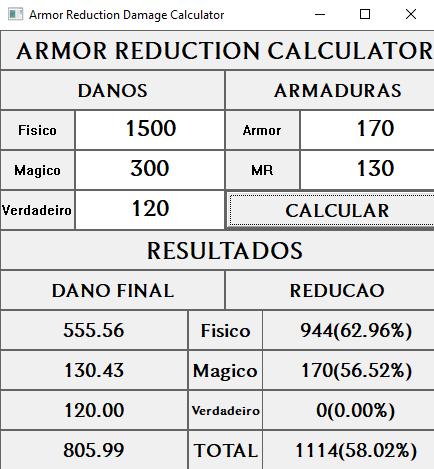

#  Calculadora de Redução de Dano – League of Legends

Este projeto é uma ferramenta em **C (Win32 API)** para calcular a redução de **dano físico**, **dano mágico** e **dano verdadeiro** no jogo **League of Legends**, com base nas estatísticas de **Armadura** e **Resistência Mágica** de um campeão.  
A calculadora utiliza as fórmulas oficiais do jogo e apresenta os resultados em uma interface gráfica.

---

##  Funcionalidades

- Calcula a redução de dano físico (**Armadura**) e dano mágico (**Resistência Mágica**).  
- Suporta valores positivos e negativos de resistência (dano reduzido ou amplificado).  
- Considera também **dano verdadeiro**, que ignora resistências.  
- Mostra a **redução percentual individual** de cada tipo de dano.  
- Mostra o **dano total final**, a **redução absoluta** e o **percentual global de redução**.  
- Interface gráfica feita com **Win32 API (windows.h)**.  

---

##  Fórmulas Utilizadas

### Para valores de Armadura/Resistência Mágica > 0

```
DanoRecebido = DanoOriginal × (100 / (100 + Resistência))
```

### Para valores de Armadura/Resistência Mágica < 0

```
DanoRecebido = DanoOriginal × (2 − (100 / (100 − Resistência)))
```

### Para dano verdadeiro

```
DanoRecebido = DanoOriginal
```

---

##  Detalhes da Implementação

- **Linguagem:** C  
- **Bibliotecas:**  
  - `windows.h` → Interface gráfica (WinAPI)  
  - `stdio.h` → Saída formatada (`snprintf`)  
  - `stdlib.h` → Conversão de string para número (`strtod`)  

---

## Exemplo

### Valores:
- **Dano Físico:** 1500  
- **Dano Mágico:** 300  
- **Dano Verdadeiro:** 120  
- **Armadura:** 170  
- **Resistência Mágica:** 130  

### Resultados:

#### Danos Finais:
- Dano Físico Final: **555.56**  
- Dano Mágico Final: **130.43** 
- Dano Verdadeiro Final: **120.00** 

#### Reduções Finais:

- Dano Físico Reduzido: **944** (62.96%)
- Dano Mágico Reduzido: **170** (56.52%)
- Dano Verdadeiro Reduzido: **0** (0.00%)

#### Totais:
- **Total Final:** 805.99  
- **Redução Total:** 1114 (58.02%)  



---

##  Observações

- Valores positivos de Armadura/MR reduzem o dano recebido.  
- Valores negativos amplificam o dano recebido.  
- Dano verdadeiro ignora resistências.  
- O programa valida entradas e trata campos vazios como `0`.  
